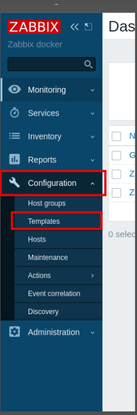
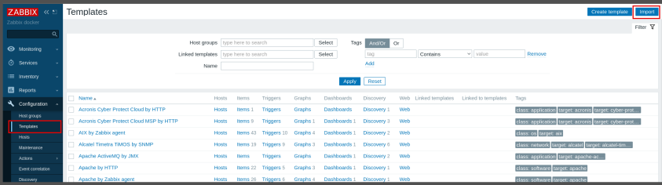
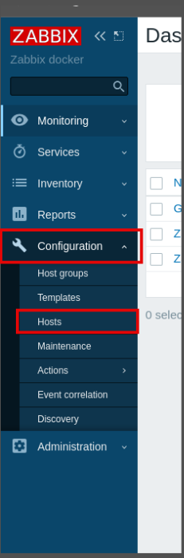
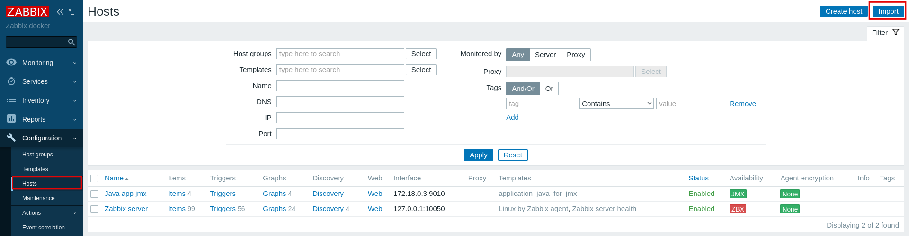

# Projeto de Monitoramento de Aplicação Java com JMX e Zabbix

Este projeto demonstra como monitorar uma aplicação Java (Spring Boot) utilizando JMX, Zabbix, Docker e PostgreSQL.

## Requisitos

- Docker
- Docker Compose
- Navegador Web

## Tecnologias Utilizadas

- **Zabbix 6.0** (server, web, java gateway)
- **PostgreSQL**
- **Java + Spring Boot** (aplicação de exemplo)
- **Docker**

## Como rodar o projeto

1. **Clone o repositório:**
   ```bash
   git clone https://github.com/Framks/ToDoListSimple.git
   cd ToDoListSimple
   ```

2. **Suba os containers:**

   Na pasta raiz do projeto execute o comando: 
   ```bash
   docker compose up --build
   ```

3. **Acesse o painel do Zabbix:**
   - URL: [http://localhost:8080/](http://localhost:8080/)
   - Usuário: `Admin`
   - Senha: `zabbix`

4. **Importe o template e o host:**
   - No menu lateral, vá em `Configuration > Templates` e importe o arquivo:
     - `monitoring/templates_zbx.yaml`
     
     
     
   - Depois, vá em `Configuration > Hosts` e importe:
     - `monitoring/host_zbx.yaml`
     
     - 
     

5. **Acesse a aplicação Java:**
   - Documentação Swagger: [http://localhost:8081/swagger-ui/index.html](http://localhost:8081/swagger-ui/index.html)

## O que você pode monitorar

- Uso de memória Heap e Non-Heap
- Número de threads
- Duração do último Garbage Collection
- Disponibilidade do Zabbix Agent
- Outros itens JMX customizados

## Dicas

- Crie dashboards personalizados no Zabbix para visualizar as métricas JMX da sua aplicação Java.
- Consulte a documentação oficial do Zabbix para mais exemplos de monitoramento JMX.

---

Pronto! Agora você pode monitorar sua aplicação Java de forma profissional usando Zabbix + JMX.

